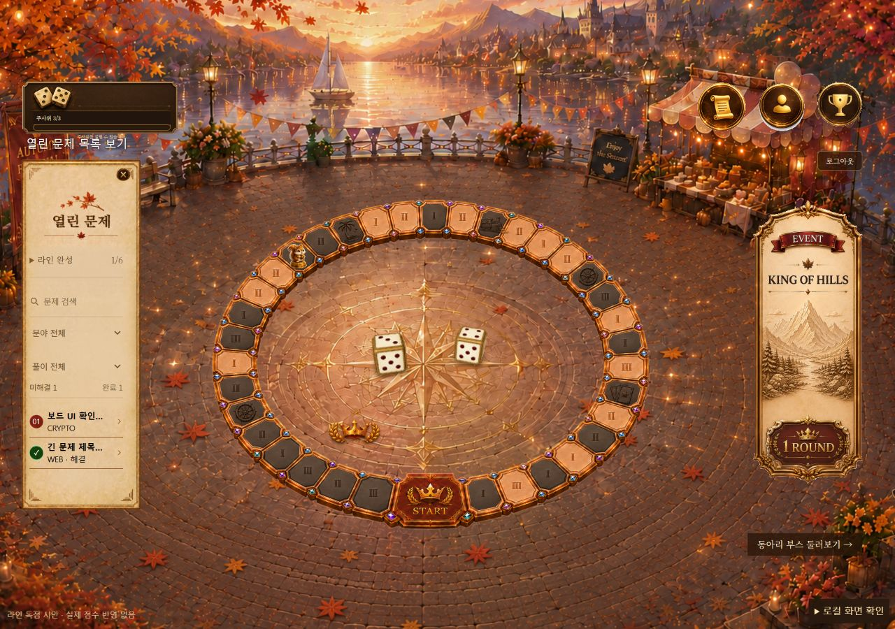
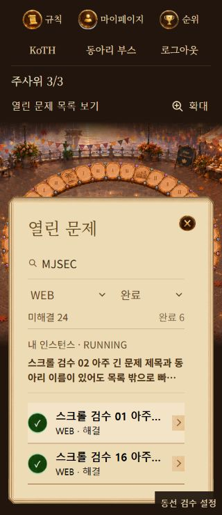

# 보드 목록 통합과 주사위 모션

기준: main 65a9571, 2026-09-29

## 변경

- 별도 열린 문제 화면을 기존 보드 양피지 펼쳐보기로 통합
- 예전 /challenges 주소는 /board?panel=challenges로 연결하며 문제 상세 주소는 유지
- 제목·동아리 검색, 분야·풀이 상태 선택, 본인 인스턴스 바로가기 제공
- 목록과 보드 칸에서 상세에 들어갔다 돌아와도 검색 조건과 스크롤 복원
- 조회 실패를 빈 목록과 구분하고 재시도 제공
- 목록 재조회 중에는 직전 목록을 유지하고 오래된 응답이 최신 결과를 덮지 않게 처리
- 인스턴스 재조회 중에도 기존 바로가기를 유지해 목록 위치가 위로 튀지 않게 처리
- 목록과 인스턴스 조회에 10초 제한과 취소 처리 적용
- 사용하지 않는 별도 목록 화면·카드·스타일·조회 훅 제거

## 주사위

- 기존 GLB 모델과 서버의 diceA, diceB 사용
- 임의 값은 회전 방향·출발 간격·착지 위치에만 사용
- 감속하며 회전하고 작은 반동 뒤에 멈추도록 변경
- 회전 중 바닥을 뚫지 않도록 현재 자세의 바닥 높이 계산
- 바닥 접촉 그림자를 추가하고 모델과 그림자 위치를 같은 프레임에 갱신
- 정지 중에는 연속 렌더링하지 않고 그림자 해상도와 화면 배율 제한
- 모션 줄이기 환경에서는 회전 없이 같은 최종 눈금 표시
- 굴림 중 재요청 차단은 기존 BoardTrack 처리 유지

## 확인

전체 테스트 218개와 프로덕션 빌드 통과
기존 500kB 초과 번들 경고는 남아 있음

자동 검사

- 서버 눈금 36조합의 최종 방향
- 바닥 높이, 감소하는 반동, 재굴림 시작 위치, 최종 주사위 간격
- 잘못된 눈금과 모션 줄이기 처리
- 검색·분야·풀이 상태 조합, 원래 열린 번호 유지, 현재 인스턴스 우선 표시
- 목록 실패·로딩·인스턴스 재조회 표시와 기존 주소 연결
- 조회 경로·취소 신호·10초 제한

로컬 브라우저 검사

- 실제 BoardPage와 ChallengeDetailPage에 로컬 응답을 넣어 페이지 이동 확인
- 옛 목록 주소에서 보드 펼쳐보기로 이동
- CRYPTO 미해결 8개로 필터 후 약 266px 스크롤한 상태에서 상세 진입
- 브라우저 뒤로가기와 화면의 문제 목록 버튼 모두 필터와 위치 복원
- 펼쳐보기 닫기·다시 열기에도 같은 위치 유지
- 보드 칸으로 문제를 열었다 돌아와도 MJSEC·WEB·완료 조건 유지
- 검색 결과 없음, 조건 초기화, 열린 문제 0개·30개 확인
- 목록 실패와 인스턴스 실패를 각각 발생시켜 안내·재시도·상세 진입 확인
- 로컬 고정 응답 1·6의 최종 눈금과 모바일 굴림 확인
- 1280px 데스크톱, 390px·320px 모바일에서 목록·긴 제목·필터 확인
- 390px·320px 문서 가로 넘침 없음

실제 대회 서버의 문제 개방, 점수 지급, 주사위 소모를 검증한 결과는 아님
모션 줄이기는 계산 테스트로 검증했으며 운영체제 설정은 변경하지 않음

## 화면

