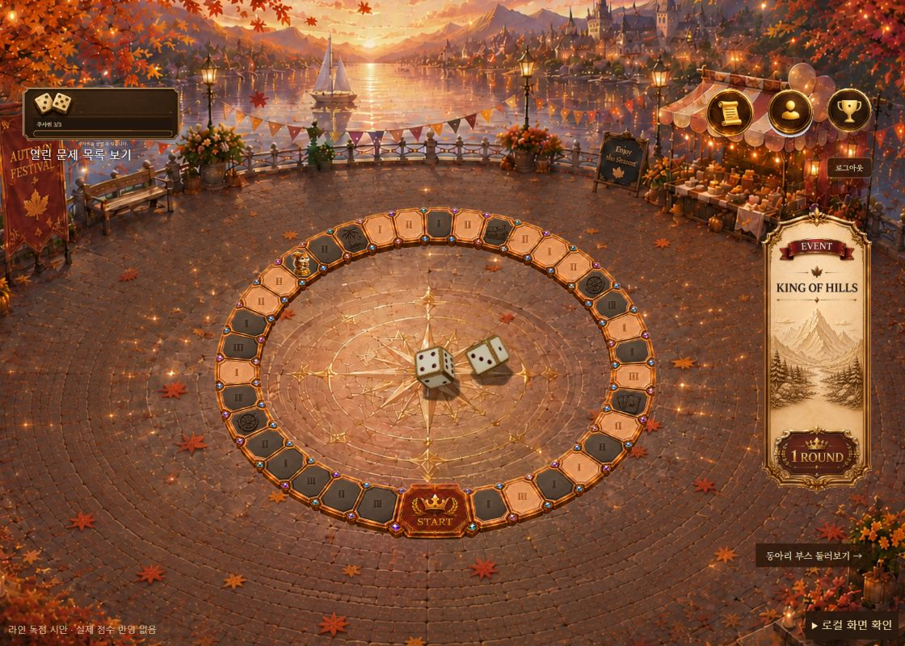
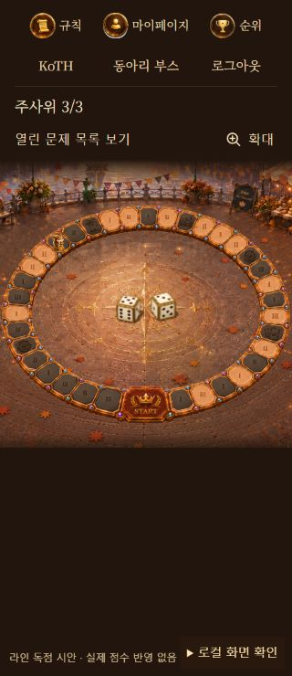

# 보드 목록 통합과 주사위 모션

기준: main 65a9571, 2026-09-29

## 변경

- 별도 열린 문제 화면을 기존 보드 양피지 펼쳐보기로 통합
- 예전 /challenges 주소는 /board?panel=challenges로 연결하며 문제 상세 주소는 유지
- 제목·동아리 검색, 분야·풀이 상태 선택, 본인 인스턴스 바로가기 제공
- 목록과 보드 칸에서 상세에 들어갔다 돌아와도 검색 조건과 스크롤 복원
- 조회 실패를 빈 목록과 구분하고 재시도 제공
- 목록 재조회 중에는 직전 목록을 유지하고 오래된 응답이 최신 결과를 덮지 않게 처리
- 인스턴스 재조회 중에도 기존 바로가기를 유지해 목록 위치가 위로 튀지 않게 처리
- 목록과 인스턴스 조회에 10초 제한과 취소 처리 적용
- 사용하지 않는 별도 목록 화면·카드·스타일·조회 훅 제거

## 주사위

- 기존 GLB 모델과 서버의 diceA, diceB 사용
- cannon-es로 중력, 바닥 마찰, 반동, 두 주사위 사이의 충돌 계산
- 오른쪽 위에서 던지는 방식을 유지하고 투척 자세·회전·충돌 경로에 변화를 줌
- 1/120초 간격으로 경로를 먼저 계산하고 실제 화면 주기에 맞춰 보간
- 서버가 정한 눈금에 맞는 정육면체 대칭 회전을 처음부터 적용하며 비행·착지 중 면을 바꿔 맞추지 않음
- 첫 바닥 충돌 이후에도 두 주사위 모두 두 번 이상 면이 바뀌고 바닥 가까이에서 구르는 경로만 사용
- 공중 투척 속도는 유지하고 첫 충돌 이후 재생 속도만 0.78~0.88배로 부드럽게 전환
- 두 주사위는 같은 재생 시계를 사용해 서로 부딪히는 시점이 어긋나지 않게 처리
- 모서리가 화면 밖으로 나가거나 서로 기대어 서는 경로, 최종 눈금이 가리는 경로는 재생 전 제외
- 무작위 경로 선택은 4회로 제한하고 모두 부적합하면 바닥 구르기와 화면 범위를 검증한 32개 초기값 중 선택
- 검증 경로를 선택할 때도 직전에 쓴 경로는 피하며 동일한 물리 엔진으로 계산
- 예비 경로까지 모두 부적합한 경우에만 결과를 즉시 표시해 게임 진행 유지
- 회전 중 바닥을 뚫지 않도록 현재 자세의 바닥 높이 계산
- 광원으로 투척 높이와 자세에 따른 그림자를 계산하고 모델 위치와 같은 프레임에 갱신
- 정지 중에는 연속 렌더링하지 않고 그림자 해상도와 화면 배율 제한
- 모션 줄이기 환경에서는 물리 계산 없이 현재 자리에서 최종 눈금 표시
- 굴림 중 재요청 차단은 기존 BoardTrack 처리 유지
- 착지한 주사위까지 클릭 영역에 포함하되 주변 문제 칸은 덮지 않도록 범위 조정
- 3D 모델·물리 엔진은 보드 진입 시에만 불러오도록 별도 청크로 분리
- 공중 투척과 비중심 충격량 방식 참고: uuuulala/Threejs-rolling-dice-tutorial
- MIT 저작권 고지는 public/third-party/dice-roller.txt에 보존

## 확인

전체 테스트 225개와 프로덕션 빌드 통과
npm audit --omit=dev 취약점 0개
500kB 초과 번들 경고는 남아 있음: 기본 청크 약 524kB, 지연 로딩되는 주사위 청크 약 974kB

자동 검사

- 서버 눈금 36조합의 최종 방향
- 바닥 높이, 충돌 시점, 공중 투척 위치, 최종 주사위 간격
- 같은 결과를 20개 난수 시드로 재생해 서로 다른 경로 확인
- 200회 연속 굴림의 위치 연속성, 최종 방향 유지, 카메라 안쪽·클릭 영역 안쪽 확인
- 100개 난수 시드에서 바닥 충돌 후 각 주사위의 면 변화 횟수·바닥 이동 거리 검사
- 첫 충돌 전 속도 유지, 착지 구간의 두 주사위 시간 일치, 같은 예비 경로 연속 선택 방지
- 30FPS 중간 샘플링 여부와 무관하게 같은 시각의 자세가 일치하는지 확인
- 잘못된 눈금과 모션 줄이기 처리
- 검색·분야·풀이 상태 조합, 원래 열린 번호 유지, 현재 인스턴스 우선 표시
- 목록 실패·로딩·인스턴스 재조회 표시와 기존 주소 연결
- 조회 경로·취소 신호·10초 제한

로컬 브라우저 검사

- 실제 BoardPage와 ChallengeDetailPage에 로컬 응답을 넣어 페이지 이동 확인
- 옛 목록 주소에서 보드 펼쳐보기로 이동
- CRYPTO 미해결 8개로 필터 후 약 266px 스크롤한 상태에서 상세 진입
- 브라우저 뒤로가기와 화면의 문제 목록 버튼 모두 필터와 위치 복원
- 펼쳐보기 닫기·다시 열기에도 같은 위치 유지
- 보드 칸으로 문제를 열었다 돌아와도 MJSEC·WEB·완료 조건 유지
- 검색 결과 없음, 조건 초기화, 열린 문제 0개·30개 확인
- 목록 실패와 인스턴스 실패를 각각 발생시켜 안내·재시도·상세 진입 확인
- 로컬 고정 응답 1·6의 최종 눈금과 모바일 굴림 확인
- 3·3 고정 응답을 반복 재생해 다른 이동 경로와 회전·충돌 시점 확인
- 320px에서 주사위 클릭 영역 약 141×77px, 문서 가로 넘침 없음
- 착지 후 굴림 버튼 활성화와 콜백 완료 표시 확인
- 바닥 구르기 변경 후 1120px·390px·320px에서 투척·충돌·착지와 1·6, 3·3 눈금 확인
- 굴림 중 버튼 비활성화, 모바일 문서 가로 넘침 없음 확인
- 1280px 데스크톱, 390px·320px 모바일에서 목록·긴 제목·필터 확인
- 390px·320px 문서 가로 넘침 없음

실제 대회 서버의 문제 개방, 점수 지급, 주사위 소모를 검증한 결과는 아님
모션 줄이기는 계산 테스트로 검증했으며 운영체제 설정은 변경하지 않음

별도 로컬 Node 반복 시험 2,000회에서 즉시 결과 표시 0회, 최종 눈금 불일치 0회
1,951회는 검증된 초기값을 사용했으며 같은 경로를 연속으로 선택한 경우는 없었음
전체 모션 길이는 약 1.87~3.15초
경로 계산은 평균 약 6ms, 최대 약 52ms였으며 빌드·테스트를 동시에 실행한 로컬 측정값임
이 수치는 모바일 기기의 FPS 측정값은 아님

## 화면

같은 굴림의 투척, 바닥 회전, 착지

