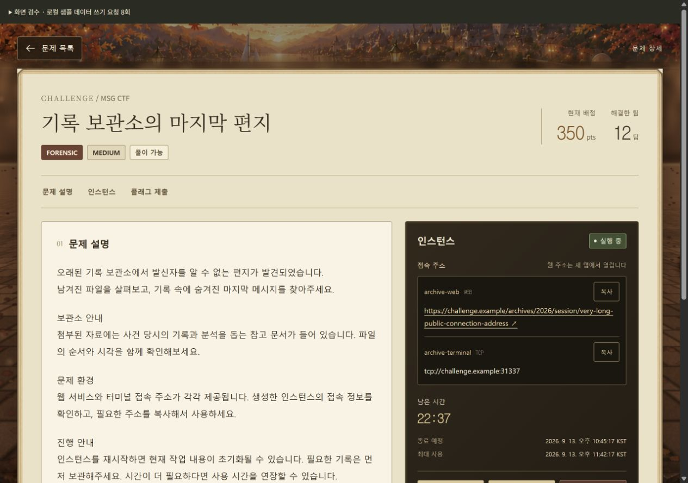
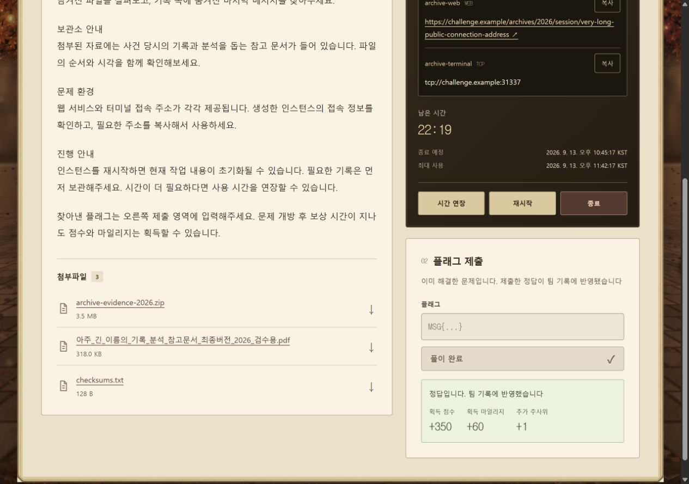
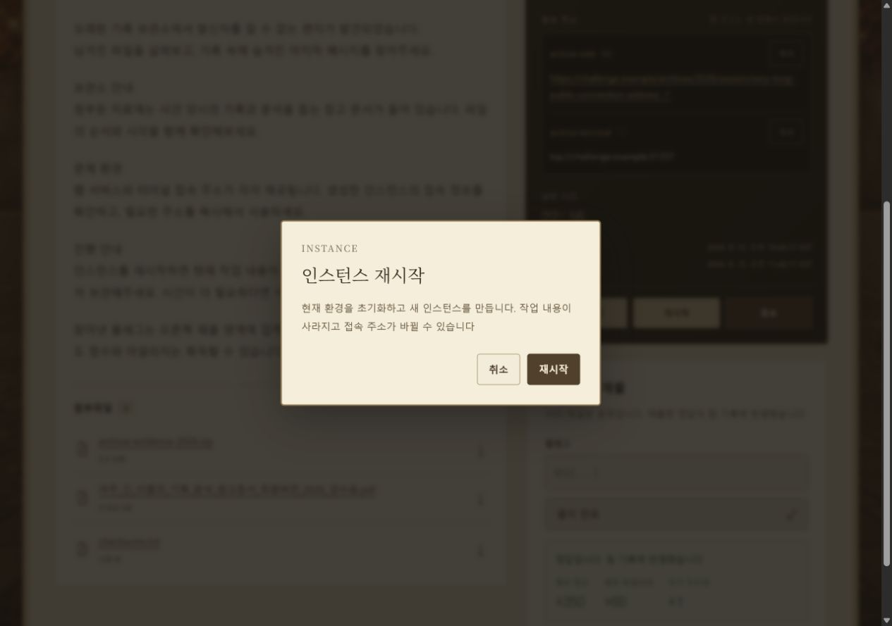
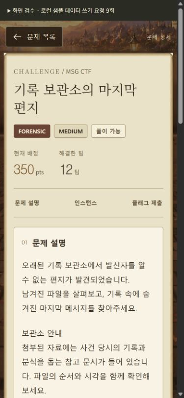
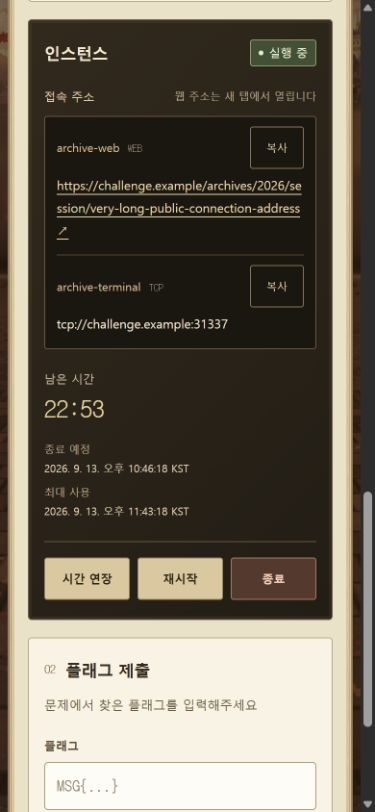

# 문제 상세 화면 검수

검수일: 2026-09-13

기준: front-team main 07436d9735a562e54a47f02b2b5ed072ca2c3d69

문제 상세 페이지와 실제 API 호출 함수를 렌더링하고, 로컬 검수용 Axios adapter로 응답 상태를 바꿔 확인함
이미지의 문제 본문, 파일명, 접속 주소, 보상 값은 검수용 샘플 데이터이며 실제 대회 데이터가 아님

## 자동 검증

- 기존 회귀 테스트 8개와 추가 테스트 12개, 총 20개 통과
- 문제 상세 조회 실패와 복구, 권한 회수, 인스턴스 부분 실패, 상태별 제어, URL 및 첨부파일 크기 처리 확인
- npm run build 통과
- git diff --check 통과

재현 명령

    node --test src/features/challenges/utils/*.test.js
    npm run build

## 브라우저 검증

| 항목 | 확인 결과 |
| --- | --- |
| 1280 × 900 데스크톱 | 긴 본문, 여러 접속 주소, 긴 첨부파일명이 영역 안에서 표시됨 |
| 768 × 1024 태블릿 | 한 열 배치와 폼 간격 확인, 가로 넘침 없음 |
| 390 × 844 모바일 | 제목 줄바꿈, 영역 바로가기, 접속 정보와 버튼 간격 확인, 가로 넘침 없음 |
| 320 × 780 모바일 | 본문과 확인창을 포함해 가로 넘침 없음 |
| 모바일 인스턴스 제어 | 복사·연장·재시작·종료 버튼의 높이 44px 확인 |
| 주소 복사 | 대상 주소의 복사 완료 안내 표시 확인 |
| 오답 제출 | 입력 값 유지, 제출 영역 안에 오류 표시 |
| 재제출 제한 | 응답의 8초 대기 시간을 표시하고 만료 후 제출 버튼 활성화 |
| 정답 제출 | 응답의 점수 350, 마일리지 60, 추가 주사위 1 표시 및 재제출 차단 |
| 인스턴스 생성 | 요청 1회 후 준비 상태에서 제어 비활성화, 이후 실행 상태 갱신 |
| 인스턴스 교체 | 이전 문제 이름 표시, 취소 시 요청 없음, 확인 후 새 인스턴스 반영 |
| 재시작·종료 | 확인 후 요청, 준비·종료 중 접속 주소 숨김 |
| 시간 연장 | 응답의 종료 예정 시각과 남은 시간 갱신 |
| 연장 한도 | 서버가 연장 횟수 3회를 제공한 경우 연장 버튼 비활성화 |
| 키보드 확인창 | 취소에 초기 포커스, Esc 및 취소 시 호출 버튼으로 포커스 복귀 |
| 일시적인 상세 조회 오류 | 본문과 입력 유지, 상태 확인 전 제출·인스턴스 작업 대기, 재조회 복구 |
| 인스턴스 조회 오류 | 이전 주소 숨김, 문제 설명과 플래그 제출 유지, 재조회 복구 |
| 문제 접근 권한 회수 | 이전 본문과 접속 정보 제거, 접근 불가 안내 표시 |

기존 4173 로컬 미리보기에도 동일한 문제 상세 소스를 반영하고 모의 API 응답으로 화면이 표시되는 것을 확인함
기존 로컬 대회 진행 상태는 검수 중 변경하지 않음
실제 배포 백엔드·Scheduler를 통한 인스턴스 실행은 이번 검증에 포함하지 않음

## 검수 이미지

데스크톱 제목·본문·접속 정보

플래그 정답 및 실제 응답 값에 따른 보상 표시

재시작 확인창

모바일 제목과 본문

모바일 접속 정보와 제어 버튼

