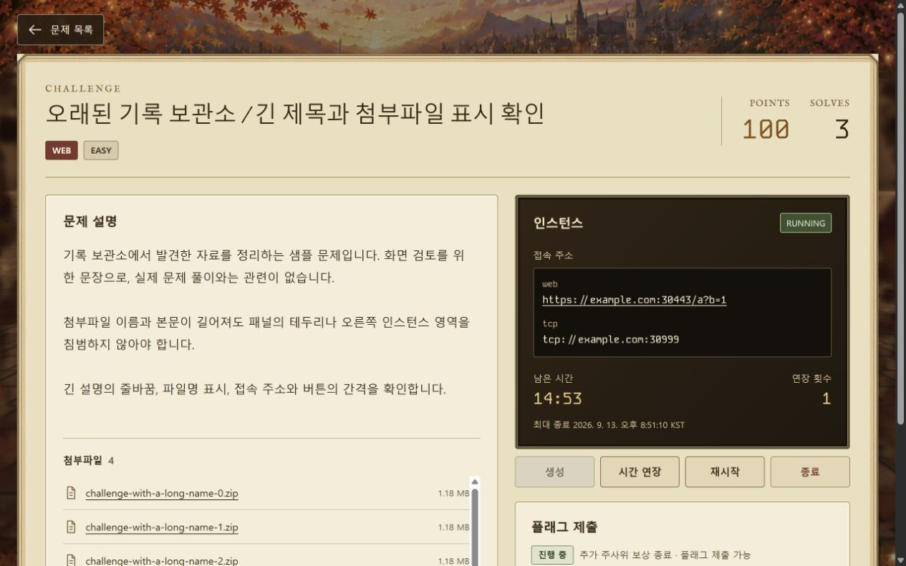
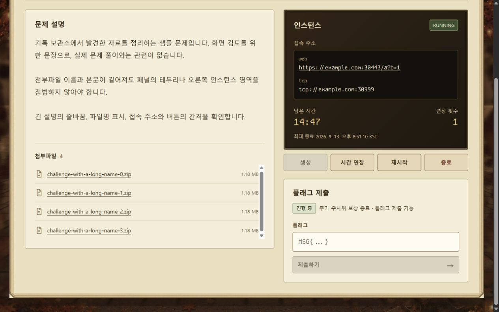
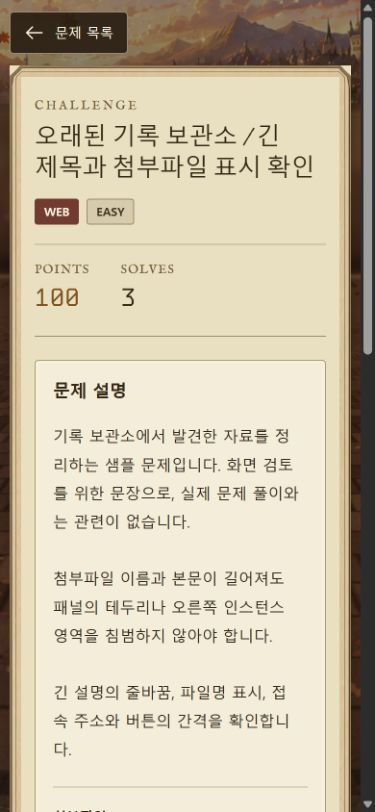
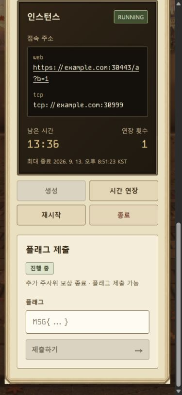

문제 상세 화면 검수

2026-09-13 로컬 fixture 캡처

긴 한국어 제목, 설명 3개 문단, 첨부파일 4개, 접속 주소 2개가 있는 화면
1280×800 및 390×844 뷰포트에서 본문, 테두리, 제출 영역과 버튼 간격 확인
작은 화면은 설명과 인스턴스를 세로로 배치하며 입력창과 버튼이 패널 안에 유지됨
재제출 대기와 오류 안내가 입력창 아래에 별도 배치되는 상태 확인

샘플 주소와 데이터만 사용했으며 실제 문제 서버나 제출 결과를 증명하는 이미지는 아님

