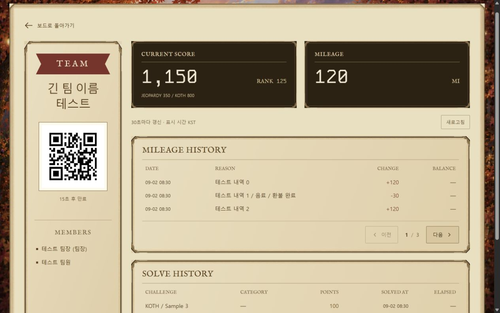
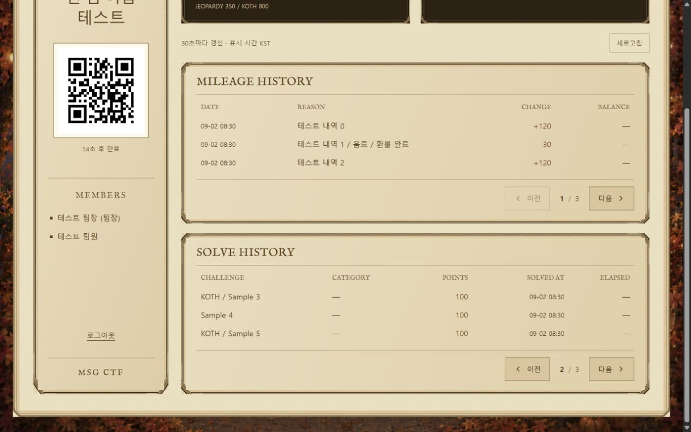
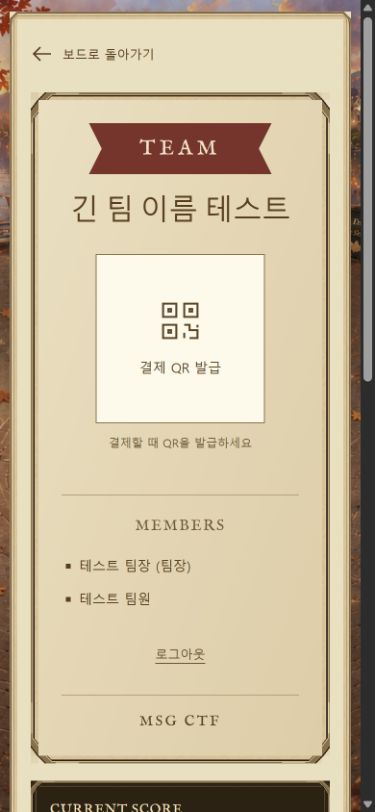
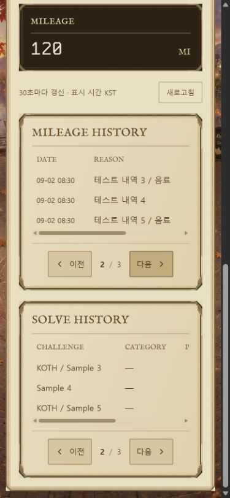

마이페이지 화면 검수

2026-09-13 로컬 fixture 캡처

긴 팀명, 125위, 기록 7개, 테스트 QR 발급 상태
1280×800 및 390×844 뷰포트에서 카드, QR, 표와 페이지 이동 버튼 확인
QR 영역은 176×176px 정사각형, 페이지 버튼은 높이 44px
390px 화면에서 표와 버튼 간격 35px, 버튼 아래 패널 끝까지 22px
긴 표는 표 안에서 가로로 스크롤되며 페이지 전체에는 가로 넘침이 없음
마지막 한 건에서 이전 페이지 세 건으로 이동해도 페이지 이동 영역의 문서상 위치 유지

QR에 담긴 값은 fixture-payment-token이며 실제 결제에 사용할 수 없는 테스트 값
분야, 소요 시간, 기록별 잔액은 API 미제공 항목이므로 대시로 표시

